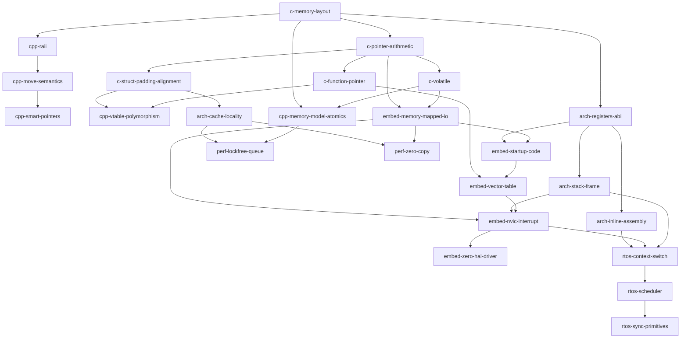

# Cây Tri Thức Chuẩn: C++ & Embedded Systems (Knowledge Graph)

Tài liệu này định nghĩa cấu trúc đồ thị tri thức (Directed Acyclic Graph - DAG) cho toàn bộ lộ trình học tập từ nền tảng C, Modern C++, Kiến trúc phần cứng/Assembly, Lập trình nhúng Bare-metal cho đến RTOS và Hệ thống thời gian thực tối ưu cao.

---

## 1. Cấu Trúc Các Nhóm Tri Thức (Knowledge Nodes)

Mỗi node bao gồm: `ID`, `Tên khái niệm`, `Điều kiện tiên quyết (Prerequisites)`, `Mục tiêu thấu hiểu bản chất (Core Mental Model)`.

### Nhóm 1: C & Pointer Mastery (Nền tảng Bộ nhớ & Con trỏ)

1. **`c-memory-layout` (Bố cục bộ nhớ tiến trình)**
   - *Prereq*: Không
   - *Mental Model*: Hiểu rõ 5 phân vùng: Text/Code, Data, BSS, Heap, Stack. Phân biệt rõ biến cục bộ, toàn cục, `static`, thời điểm cấp phát và thu hồi.
2. **`c-pointer-arithmetic` (Con trỏ & Số học con trỏ)**
   - *Prereq*: `c-memory-layout`
   - *Mental Model*: Con trỏ là một biến chứa địa chỉ bộ nhớ; `ptr + 1` bước nhảy theo `sizeof(*ptr)`. Bộ nhớ là một mảng byte phẳng liên tục.
3. **`c-function-pointer` (Con trỏ hàm & Callback)**
   - *Prereq*: `c-pointer-arithmetic`
   - *Mental Model*: Hàm thực chất nằm ở phân vùng Text; con trỏ hàm trỏ tới địa chỉ lệnh đầu tiên của hàm; nền tảng của Virtual Method Table và Event-driven pattern.
4. **`c-volatile` (Từ khóa `volatile`)**
   - *Prereq*: `c-pointer-arithmetic`
   - *Mental Model*: Báo cho trình biên dịch biết biến có thể bị thay đổi bởi ngoại vi/phần cứng ngoài tầm kiểm soát của luồng thực thi hiện tại; cấm compiler tối ưu hóa cache giá trị vào thanh ghi CPU.
5. **`c-struct-padding-alignment` (Đệm cấu trúc & Canh lề bộ nhớ)**
   - *Prereq*: `c-pointer-arithmetic`
   - *Mental Model*: Bus dữ liệu CPU (32-bit / 64-bit) đọc căn lề tự nhiên hiệu quả nhất; compiler chèn padding byte; `__attribute__((packed))` và chi phí unaligned access trên CPU.

---

### Nhóm 2: Modern C++ Core & Zero-Cost Abstractions

6. **`cpp-raii` (RAII - Resource Acquisition Is Initialization)**
   - *Prereq*: `c-memory-layout`
   - *Mental Model*: Ràng buộc vòng đời của tài nguyên phần cứng/bộ nhớ vào vòng đời của đối tượng trên Stack. Destructor tự động dọn dẹp khi rời khỏi scope (kể cả khi throw exception).
7. **`cpp-move-semantics` (Move Semantics & Rvalue References `&&`)**
   - *Prereq*: `cpp-raii`, `c-pointer-arithmetic`
   - *Mental Model*: Chuyển giao quyền sở hữu con trỏ/tài nguyên thay vì sao chép sâu (deep copy); `std::move` chỉ là ép kiểu rvalue static_cast, không sinh mã copy.
8. **`cpp-smart-pointers` (Smart Pointers: unique_ptr, shared_ptr, weak_ptr)**
   - *Prereq*: `cpp-move-semantics`, `cpp-raii`
   - *Mental Model*: `unique_ptr` là zero-cost wrapper quanh raw pointer; `shared_ptr` mang theo Control Block (reference counter + custom deleter) với chi phí atomic increment/decrement.
9. **`cpp-vtable-polymorphism` (Tính đa hình & Cơ chế VTable)**
   - *Prereq*: `c-function-pointer`, `c-struct-padding-alignment`
   - *Mental Model*: Mỗi class có ít nhất 1 virtual function đều được chèn thêm con trỏ `_vptr` trỏ tới bảng VTable; chi phí 2 lần dereference bộ nhớ và làm mất cơ hội inline function của compiler.
10. **`cpp-memory-model-atomics` (C++ Memory Model & `std::atomic`)**
    - *Prereq*: `c-volatile`, `c-memory-layout`
    - *Mental Model*: Phân biệt rõ Data Race và Race Condition; các mức thứ tự bộ nhớ (`memory_order_relaxed`, `acquire/release`, `seq_cst`); phân biệt CPU Memory Barrier với Compiler Barrier.

---

### Nhóm 3: Kiến Trúc Máy Tính & Hợp Ngữ (Low-Level Architecture & ASM)

11. **`arch-registers-abi` (Tập thanh ghi CPU & Calling Conventions)**
    - *Prereq*: `c-memory-layout`
    - *Mental Model*: Thanh ghi đa năng (R0-R12 trên ARM, RAX/RBX/RCX... trên x86), Stack Pointer (SP), Link Register (LR / return address), Program Counter (PC). Quy tắc hàm ai lưu thanh ghi nào (caller-saved vs callee-saved).
12. **`arch-stack-frame` (Cấu trúc Stack Frame & Exception Entry)**
    - *Prereq*: `arch-registers-abi`
    - *Mental Model*: Quá trình `push`/`pop`, thanh ghi cơ sở Frame Pointer (FP/R7/R11). Khi xảy ra ngắt hoặc exception, CPU tự động đẩy phần cứng các thanh ghi ngữ cảnh (hardware context save) vào stack như thế nào.
13. **`arch-inline-assembly` (Hợp ngữ lồng ghép - Inline ASM)**
    - *Prereq*: `arch-registers-abi`
    - *Mental Model*: Cú pháp GCC Inline ASM: `asm volatile ("instruction" : outputs : inputs : clobbers)`. Khai báo clobber list để compiler không phá hỏng thanh ghi hoặc bộ nhớ.
14. **`arch-cache-locality` (Bộ nhớ đệm CPU & Cache Line)**
    - *Prereq*: `c-struct-padding-alignment`
    - *Mental Model*: L1/L2/L3 Cache, kích thước Cache Line (thường 64 byte), L1 Data Cache vs Instruction Cache, hiện tượng Cache Miss, False Sharing trong môi trường đa lõi.

---

### Nhóm 4: Lập Trình Nhúng & Vi Điều Khiển (Embedded & Bare-Metal)

15. **`embed-memory-mapped-io` (MMIO - Giao tiếp phần cứng qua địa chỉ bộ nhớ)**
    - *Prereq*: `c-volatile`, `c-pointer-arithmetic`
    - *Mental Model*: Mọi ngoại vi (GPIO, UART, Timer, SPI) thực chất là các thanh ghi được ánh xạ vào không gian địa chỉ bộ nhớ vật lý. Thao tác bitwise trực tiếp qua con trỏ ép kiểu `volatile uint32_t*`.
16. **`embed-startup-code` (Quy trình khởi động & Startup Code)**
    - *Prereq*: `c-memory-layout`, `arch-registers-abi`
    - *Mental Model*: CPU vừa cấp nguồn chạy từ đâu? Khởi tạo con trỏ Stack đỉnh (`_estack`), sao chép đoạn `.data` từ Flash vào RAM, xóa trắng đoạn `.bss`, gọi hàm `SystemInit` rồi nhảy tới `main()`.
17. **`embed-vector-table` (Bảng Vector Ngắt - Vector Table)**
    - *Prereq*: `embed-startup-code`, `c-function-pointer`
    - *Mental Model*: Mảng các con trỏ hàm được đặt tại địa chỉ đầu (offset 0x00000000 hoặc ánh xạ VTOR); phần tử đầu là Stack Pointer, các phần tử tiếp theo là Reset_Handler, NMI, HardFault, và các ngắt ngoại vi.
18. **`embed-nvic-interrupt` (Bộ điều khiển ngắt NVIC & ISR)**
    - *Prereq*: `embed-vector-table`, `arch-stack-frame`, `embed-memory-mapped-io`
    - *Mental Model*: Phân cấp mức ưu tiên (Preemption Priority vs Sub-priority), cơ chế Tail-chaining, Late arrival; cách CPU tự động push context khi vào ISR và dùng giá trị EXC_RETURN để pop context khi thoát ISR.
19. **`embed-zero-hal-driver` (Viết Driver Bare-Metal không dùng thư viện hãng)**
    - *Prereq*: `embed-memory-mapped-io`, `embed-nvic-interrupt`
    - *Mental Model*: Tự định nghĩa cấu trúc struct thanh ghi, bật xung Clock ngoại vi (RCC), cấu hình chân I/O và thanh ghi điều khiển mà không phụ thuộc STM32 HAL / Arduino, tối ưu hóa kích thước code và xung nhịp.

---

### Nhóm 5: Hệ Điều Hành Thời Gian Thực (RTOS & Concurrency)

20. **`rtos-context-switch` (Chuyển đổi ngữ cảnh - Context Switching)**
    - *Prereq*: `arch-stack-frame`, `embed-nvic-interrupt`, `arch-inline-assembly`
    - *Mental Model*: Ngắt PendSV / SysTick lưu các thanh ghi còn lại (software context save R4-R11) vào Stack của Task cũ, hoán đổi con trỏ SP sang Stack của Task mới, và phục hồi thanh ghi để chuyển task.
21. **`rtos-scheduler` (Bộ lập lịch Task & Trạng thái Task)**
    - *Prereq*: `rtos-context-switch`
    - *Mental Model*: Ready List, Blocked List, Suspended List; giải thuật lập lịch Round-robin vs Preemptive Priority-based Scheduler.
22. **`rtos-sync-primitives` (Đồng bộ hóa: Semaphore, Mutex, Priority Inversion)**
    - *Prereq*: `rtos-scheduler`
    - *Mental Model*: Phân biệt rõ Binary Semaphore (tín hiệu sự kiện) và Mutex (quyền sở hữu tài nguyên); hiểm họa Nghịch đảo độ ưu tiên (Priority Inversion) và giải pháp Priority Inheritance.

---

### Nhóm 6: Tối Ưu Hóa & Lập Trình Không Khóa (High-Performance & Lock-Free)

23. **`perf-lockfree-queue` (Hàng đợi không khóa - Lock-Free Ring Buffer / SPSC Queue)**
    - *Prereq*: `cpp-memory-model-atomics`, `arch-cache-locality`
    - *Mental Model*: Single-Producer Single-Consumer queue chỉ dùng `std::atomic<size_t>` với quan hệ `memory_order_release` và `memory_order_acquire`; cách pad cache line để chống False Sharing giữa head và tail.
24. **`perf-zero-copy` (Kiến trúc Zero-Copy & Ring Buffer cho DMA)**
    - *Prereq*: `embed-memory-mapped-io`, `arch-cache-locality`
    - *Mental Model*: Ngoại vi DMA chuyển trực tiếp dữ liệu từ thanh ghi vào RAM mà không tốn chu kỳ CPU; bài toán Cache Invalidation / Cache Clean khi CPU có D-Cache bật.

---

## 2. Bảng Quan Hệ Phụ Thuộc (Dependency Matrix)

---

## 3. Quy Tắc Cảnh Báo Điều Kiện Tiên Quyết (Prerequisite Enforcement Rule)

Khi học viên yêu cầu học một chủ đề `Target`:
1. Agent tra cứu toàn bộ danh sách `Prerequisites` của `Target`.
2. Kiểm tra trong `learning_profile.json`:
   - Nếu có bất kỳ Prerequisite nào ở trạng thái `MISSING` (Chưa học) hoặc `WEAK` (Điểm dưới 70):
     - **CẢNH BÁO BẮT BUỘC:** Không cho phép nhảy cóc vào chi tiết phức tạp của bài học.
     - Nêu rõ lý do: *"Học `Context Switching` khi chưa nắm vững `Stack Frame` và `Exception Entry` sẽ biến bạn thành thợ copy code ASM mà không hiểu CPU đang push thanh ghi nào vào đâu."*
     - Đưa ra 2 phương án: Ôn tập nhanh 5 phút Prerequisite còn thiếu, hoặc chèn một mini-module giải thích Prerequisite đó trước khi vào bài chính.
